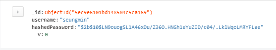
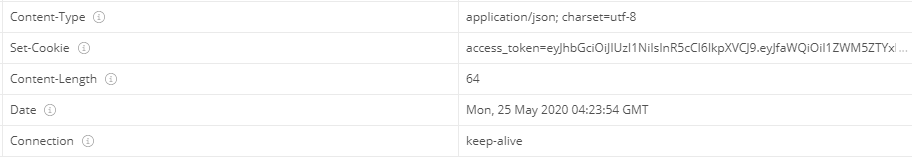
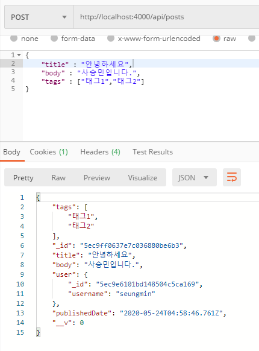

# ✔ JWT를 통한 회원 인증 구현하기
- JWT는 JSON Web Token의 약자로 데이터가 JSON으로 이루어져 있는 토큰을 의미한다.  
- 토큰 기반 인증 시스템❓
  - 토큰은 로그인 이후 서버가 만들어주는 문자열로 사용자의 로그인 정보가 들어 있고, 해당 정보가 서버에서 발급되었음을 증명하는 서명이 들어 있다.
  - 서명 데이터는 해싱 알고리즘(HMAC SHA256, RSA SHA256)이 사용된다.
  - 장점은 <b>서버에서 사용자 로그인 정보를 기억하기 위해 사용하는 리소스가 적다는 점이다.</b>

## ✒ 사용자 스키마/모델 만들기
- 단방향 해싱 함수를 지원해 주는 <code>bcrypt</code> 라이브러리 사용하여 비밀번호 저장
<pre>$ yarn add bcrypt</pre>
- 스키마 생성
<pre>
const UserSchema = new Schema({
  username: String,
  hashedPassword: String,
});

const User = mongoose.model('User', UserSchema);
export default User;
</pre>

## 🔸 모델 메서드 만들기
- 모델에서 사용할 수 있는 함수를 의미하며 첫 번째는 인스턴스 메서드로 모델을 통해 만든 문서 인스턴스에서 사용할 수 있는 함수이다.
- 인스턴스 메서드는 <b><code>function</code> 키워드를 사용하여 구현</b>해야 하는데 이유는 함수 내부에서 <code>this</code> 를 접근해야 하기 때문이다. (화살표 함수를 사용하면 <code>this</code>는 문서 인스턴스를 가리키지 못한다.)
<pre>
// 해시 비밀번호를 hashedPassword에 설정
<b>UserSchema.methods</b>.setPassword = async function (password) {
  const hash = await bcrypt.hash(password, 10);
  this.hashedPassword = hash;
};
</pre>
- 두 번째는 스태틱(static)메서드로 모델에서 바료 사용할 수 있는 함수이다.
<pre>
// username으로 데이터를 찾는다.
<b>UserSchema.statics</b>.findByUsername = function (username) {
  return this.findOne({ username });
};
</pre>

## 🔸 회원 인증 API 만들기 (회원가입, 로그인)
- src/api/auth/auth.ctrl.js 참고
- src/api/auth/index.js에 auth 라우터 생성
- src/api/index.js에 auth 라우터를 api 라우터에 적용
- src/models/user.js에 serialize 인스턴스 함수 생성

## ✒ 토큰 발급 및 검증하기
- 사용자의 로그인 정보를 지니고 있을 수 있도록 서버에서 토큰을 발급해 준다.
- jsonwebtoken 모듈 설치
<pre>
$ yarn add jsonwebtoken
</pre>
### 🔸 비밀키 설정하기
- .env 파일에 JWT 토큰을 만들 때 사용할 비밀키 생성
- macOS/Linux 에서는 <code>$ openssl rand -hex 64</code> 명령어 사용
### 🔸 토큰 발급하기
- src/models/user.js
<pre>
import jwt from 'jsonwebtoken';
// 토큰 발급하기
UserSchema.methods.generateToken = function () {
  const token = jwt.sign(
    // 첫 번째 파라미터에는 토큰 안에 집어넣고 싶은 데이터를 넣는다.
    {
      _id: this.id,
      username: this.username,
    },
    process.env.JWT_SECRET, // 두 번째 파라미터에는 JWT 암호를 넣는다.
    {
      expiresIn: '7d', // 7일 동안 유효함
    },
  );
  return token;
};
</pre>
- 사용자가 브라우저에서 토큰을 사용할 때는 localStorage와 sessionStorage를 사용하는 방법과 브라우저 쿠키에 담아서 사용하는 방법이 있다.
- localStorage와 sessionStorage를 사용하는 방법은 XSS(Cross Site Scripting)에 취약하다.
- 쿠키 사용은 <code>httpOnly</code> 속성을 활성화 하면 XSS로부터 안전하지만 CSRF(Cross Site Request Forgery) 공격에 취약하지만 CSRF 토큰 사용 및 Referer 검증 등을 사용해 막을 수 있다.
- src/api/auth/auth.ctrl.js - register, login
<pre>
// 토큰 생성 후 쿠키에 담기
const token = user.generateToken();
ctx.cookies.set('access_token', token, {
    maxAge: 1000 * 60 * 60 * 24 * 7, // 7일
    httpOnly: true,
});
</pre>

### 🔸 토큰 검증하기
<pre>
import jwt from 'jsonwebtoken';
// 토큰 검증 미들웨어
const jwtMiddleware = async (ctx, next) => {
  const token = ctx.cookies.get('access_token');
  if (!token) return next(); // 토큰 없음
  try {
    const decoded = jwt.verify(token, process.env.JWT_SECRET);
    ctx.state.user = {
      _id: decoded._id,
      username: decoded.username,
    };
    return next();
  } catch (e) {
    // 토큰 검증 실패
    return next();
  }
};
</pre>
- src/main.js에 app에 router 미들웨어를 적용하기 전에 적용한다.
<pre>
app.use(jwtMiddleware);
</pre>
### 🔸 토큰 재발급하기
- 날짜가 3.5일 미만이면 새로운 토큰으로 재발급 해준다.
<pre>
// jwtMiddleware.js
const now = Math.floor(Date.now() / 1000);
if (decoded.exp - now < 60 * 60 * 24 * 3.5) {
    const user = await User.findById(decoded._id);
    const token = user.generateToken();
    ctx.cookies.set('access_token', token, {
    maxAge: 1000 * 60 * 60 * 24 * 7, // 7일
    httpOnly: true,
    });
}
</pre>

### 🔸 로그아웃 기능
- src/api/auth/auth.ctrl.js
<pre>
// 로그아웃 POST /api/auth/logout
export const logout = async (ctx) => {
    ctx.cookies.set('access_token');
    ctx.status = 204; //No Content
};
</pre>

## ✒ posts API에 회원 인증 시스템 도입하기
- 로그인 해야만 작성할 수 있고 삭제와 수정은 작성자만 가능
- post 스키마 추가
<pre>
  user : {
      _id : mongoose.Types.ObjectId,
      username : String,
  }
</pre>
### 🔸 로그인했을 때만 API 사용할 수 있게 하기
- src/lib/checkLoggedIn.js 
<pre>
const checkLoggedIn = (ctx, next) => {
  if (!ctx.state.user) {
    ctx.status = 401;
    return;
  }
  return next();
};
export default checkLoggedIn;
</pre>
- <code>checkLoggedIn</code> 미들웨어를 posts 라우터에 등록
<pre>
posts.post('/', checkLoggedIn ,postsCtrl.write);
</pre>
### 🔸 포스트 작성 시 사용자 정보 넣기
<pre>
  const post = new Post({
    title,
    body,
    tags,
    <b>user: ctx.state.user</b>,
  });
</pre>

### 🔸 포스트 수정 및 삭제 시 권한 확인하기
- 작성자만 포스트를 수정하거나 삭제할 수 있도록 구현
<pre>
export const getPostById = async (ctx, next) => {
  const { id } = ctx.params;
  // 생략...
  try {
    const post = await Post.findById(id);
    // 포스트가 존재하지 않을 때
    if(!post){
      ctx.status = 404; //not found
      return;
    }
    ctx.state.post = post;
    return next();
  } catch (e) {
    ctx.throw(500,e);
  }
  return next();
};
</pre>
- posts 라우터에 등록
<pre>
posts.use('/:id', postsCtrl.getPostById, post.routes());
</pre>
- id로 찾은 포스트가 로그인 중인 사용자가 작성한 포스트인지 확인한다.
<pre>
export const checkOwnPost = (ctx, next) => {
  const {user, post} = ctx.state;
  // MongoDB에서 조회한 데이터의 id 값은 문자열과 비교할 때는 .toString() 사용해야 한다.
  if(post.user._id.toString() !== user._id){
    ctx.status = 403;
    return;
  }
  return next();
}
</pre>
- 미들웨어를 수정 및 삭제 API에 적용
<pre>
post.delete('/', checkLoggedIn, postsCtrl.checkOwnPost, postsCtrl.remove);
post.patch('/', checkLoggedIn, postsCtrl.checkOwnPost, postsCtrl.update);
</pre>