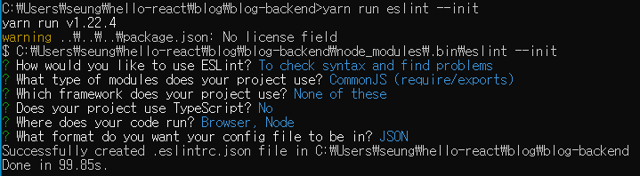

# ✔ 백엔드 프로그래밍 : Node.js의 Koa 프레임워크
### 📌 [mongoose를 이용한 MongoDB 연동 ReadMe.md로 가기](https://github.com/saseungmin/react-tutorial/blob/master/blog/blog-backend/mongoReadme.md)

> - Koa는 미들웨어 기능만 갖추고 있으며 나머지는 다른 라이브러리를 적용하여 사용한다.
> - Koa는 필요한 기능들만 붙여서 서버를 만들 수 있기 때문에 Express보다 훨씬 가볍다.
> - Koa는 <code>async/await</code> 문법을 정식으로 지원하기 때문에 비동기 작업을 더 편하게 관리할 수 있다.

## 1. 작업 환경 준비하기
- 프로젝트 생성
<pre>
$ mkdir blog-backend
$ cd blog-backend
$ yarn init -y
</pre>
- Koa 웹 프레임워크 설지
<pre>
$ yarn add koa
</pre>
- ESLint 설치

- Prettier 설정 후 Prettier에서 관리하는 코드 스타일은 ESLint에서 관리하지 않도록 <code>eslint-config-prettier</code> 설치
<pre>
$ yarn add eslint-config-prettier
</pre>
- 설치 후 .eslintrc.json 설정
<pre>
"extends": ["eslint:recommended","prettier"],

"rules": {
    "no-unused-vars" :"warn", // 선언후 사용하지 않으면 노란줄
    "no-console" : "off" // 콘솔 사용
}
</pre>

## 2. Koa 기본 사용법
- 서버 띄우는 방법 (index.js 작성 후 index.js는 해당 디렉터리까지만 입력해도 실행된다.)
<pre>$ node src</pre>

### 2.1 미들웨어
> - Koa 애플리케이션은 미들웨어의 배열로 구성되어 있다.
> - 첫 번째 파라미터는 웹 요청과 응답에 관한 정보를 지니고 있다.
> - 두 번째 파라미터는 현재 처리 중인 미들웨어의 다음 미들웨어를 호출하는 함수이다.
> - <code>next</code>함수를 호출하지 않으면, 그다음 미들웨어는 처리되지 않는다.
> - 미들웨어는 <code>app.use</code> 를 사용하여 등록되는 순서대로 처리한다.
<pre>
app.use((ctx, next) => {
    console.log(ctx.url);
    next();
});
</pre>
> - 조건부로 다음 미들웨어 처리를 무시하게 만들 수 있다.
> - 요청 경로에 authorized = 1이라는 쿼리 파라미터가 포함되어 있으면 이후 미들웨어를 처리하고 그렇지 않으면 이후 미들웨어는 처리하지 않는다.
<pre>
// http://localhost:4000/?authorized=1
app.use((ctx, next) => {
    console.log(ctx.url);
    if (ctx.query.authorized !== '1') {
    ctx.status = 401; //Unauthorized
    return;
    }
    next();
});
</pre>
> - <code>next</code>함수를 호출하면 <code>Promise</code>를 반환한다.
> - <code>next</code>함수 반환하는 <code>Promise</code>는 다음에 처리해야 할 미들웨어가 끝나야 완료된다.
<pre>
app.use((ctx, next) => {
  console.log(ctx.url);
  console.log(1);
  if (ctx.query.authorized !== '1') {
    ctx.status = 401; //Unauthorized
    return;
  }
  // next는 Promise를 반환한다.
  next().then(() => {
    console.log('END');
  });
});
</pre>
> - Koa는 <code>async/await</code>를 정식으로 지원하기 때문에 편하게 사용가능.
<pre>
app.use(async (ctx, next) => {
  console.log(ctx.url);
  console.log(1);
  if (ctx.query.authorized !== '1') {
    ctx.status = 401; //Unauthorized
    return;
  }
  // Koa는 async/await를 정식으로 지원한다.
  await next();
  console.log('END');
});
</pre>

## 3. nodemon 사용하기
- 서버 코드를 변경할 떄 마다 서버를 재시작 해야되지만 <code>nodemon</code>을 사용하면 코드가 변경될 때마다 자동으로 서버를 재시작 해준다.
<pre>$ yarn add --dev nodemon</pre>
- package.json scripts 입력
<pre>
"scripts": {
    "start": "node src",  // 서버를 시작하는 명령어 입력
    // src 디렉터리를 주시하고 있다가 해당 디렉터리 내부가 변경되면 src/index.js를 재시작 해준다.
    "start:dev": "nodemon --watch src/ src/index.js" 
}
</pre>

## 4. Koa-router 사용하기
- Koa를 사용할 때 다른 주소로 요청이 들어올 경우 다른 작업을 처리할 수 있다로고 라우터를 사용해야 한다.
<pre>
$ yarn add koa-router
</pre>

### 4.1 기본 사용법
- 첫 번째 파라미터에는 라우트 경로를 넣고, 두 번째 파라미터에는 해당 라우트에 적용할 미들웨어 함수를 넣는다.
- 라우터의 파라미터를 설정할 떄는 <code>/about/:name</code> 형식으로 (:) 사용하여 설정한다.
- 쿼리일 경우 <code>/posts/?id=10</code> 으로 요청했을시 받는다.
<pre>
const Koa = require('koa');
const Router = require('koa-router');
const app = new Koa();
const router = new Router();

router.get('/', (ctx) => {
  ctx.body = '홈';
});

// http://localhost:4000/about/react
router.get('/about/:name', (ctx) => {
  const { name } = ctx.params;
  // name의 존재 유무에 따라 다른 결과 출력
  ctx.body = name ? `${name}의 소개` : '소개';
});

// http://localhost:4000/posts?id=승민
router.get('/posts', (ctx) => {
  const { id } = ctx.query;
  // id의 존재 유무에 따라 다른 결과 출력
  ctx.body = id ? `포스트 #${id}` : '포스트 아이디가 없습니다.';
});

// app 인스턴스에 라우터 적용
app.use(router.routes()).use(router.allowedMethods());
</pre>

### 4.2 posts 라우트 생성
- <code>GET</code> 메소드는 웹 브라우저에서 주소를 입력하여 테스팅을 할 수 있지만, <code>POST,DELETE,PUT,PATCH</code> 메서드를 사용하는 API는 자바스크립트를 호출해야 한다.
- REST API 요청 테스팅을 쉽게 할 수 있는 Postman 설치 (https://www.postman.com/)
- <code>POST/PUT/PATCH</code>같은 메서드의 Request Body에 JSON 형식으로 데이터를 넣어주면, 이를 파싱하여 서버에서 사용할 수 있게 해주는 <code>Koa-bodyparser</code> 미들웨어 설치
<pre>$ yarn add koa-bodyparser</pre>
- <b>❗ 주의할 점: </b> <code>router</code>를 적용하는 코드의 윗부분에서 해야한다.
<pre>
const bodyParser = require('koa-bodyparser');

router.use('/api', api.routes()); //api 라우트 적용
// 라우터 적용전에 bodyParser 적용
<b>app.use(bodyParser());</b>
// app 인스턴스에 라우터 적용
app.use(router.routes()).use(router.allowedMethods());
</pre> 
- posts/posts.ctrl.js 작성 후 라우트에 연결
<pre>
// src/api/posts/index.js
const Router = require('koa-router');
const postsCtrl = require('./posts.ctrl');
const post = new Router();

post.get('/', postsCtrl.list);
post.post('/', postsCtrl.write);
post.get('/:id', postsCtrl.read);
post.delete('/:id', postsCtrl.remove);
// 데이터를 새 정보로 통째로 교체할 때 사용
post.put('/:id', postsCtrl.replace);
// 데이터의 특정 필드를 수정할 때 사용
post.patch('/:id', postsCtrl.update);
module.exports = post;
</pre>

### 📌 [mongoose를 이용한 MongoDB 연동 ReadMe.md로 가기](https://github.com/saseungmin/react-tutorial/blob/master/blog/blog-backend/mongoReadme.md)