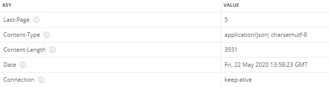

# ✔ mongoose를 이용한 MongoDB 연동
### 📌 [JWT를 통한 회원 인증 ReadMe.md로 가기](https://github.com/saseungmin/react-tutorial/blob/master/blog/blog-backend/JWTReadme.md)

- MongoDB는 문서 지향적 NoSQL 데이터베이스.
- 새로운 무서를 만들면 <code>_id</code>라는 고윳값을 자동으로 생성한다.
- <code>_id</code> 값은 시간, 머신 아이디, 프로세스 아이디, 순차 번호로 되어 있어 값의 고유함을 보장한다.
<pre>
{
    "_id": "5ec75011152e9647e89c19b7", => ObjectId
    "username" : "seungmin",
    "name" : {first : "seungmin", last : "sa"}
}
</pre>

> - 📌 MongoDB 참조 문서 : https://docs.mongodb.com/manual/
> - 📌 MongoDB 설치 : https://www.mongodb.com/download-center/community
- MongoDB 설치 확인
<pre>
$ cd C:\Program Files\MongoDB\Server\4.2\bin
$ mongo
$ version()
</pre>

## ✒ mongoose 설치 및 적용
- <code>mongoose</code>는 Node.js 환경에서 사용하는 MongoDB 기반 ODM(Object Data Modelling) 라이브러리이다.
- 이 라이브러리는 데이터베이스 문서들을 자바스크립트 객체처럼 사용할 수 있게 해준다.
- <code>dotenv</code>는 환경변수들을 파일에 넣고 사용할 수 있게 하는 개발 도구이다.
- 환경변수 파일은 <code>.gitignore</code>를 작성 후 제외시켜야한다.
- <code>mongoose</code>를 이용하여 서버와 데이터베이스를 연결한다.
<pre>
$ yarn add mongoose dotenv

// dotenv를 불러와서 config() 함수를 호출해 process.env로 조회할 수 있다.
require('dotenv').config();
const mongoose = require('mongoose');
// 비구조화 할당을 통해 process.env 내부 값에 대한 레퍼런스 만들기
const { PORT, MONGO_URI } = process.env;

// mongoose를 이요해 서버와 데이터베이스와 연결
mongoose
  .connect(MONGO_URI, { useNewUrlParser: true, useFindAndModify: false })
  .then(() => {
    console.log('Connected to MongoDB');
    //createFakeData();
  })
  .catch((e) => {
    console.error(e);
  });

// 포드가 지정되어 있지 않으면 4000번 사용
const port = PORT || 4000;
app.listen(port, () => {
  console.log('Listening to port %d', port);
});
</pre>

## ✒ esm으로 ES모듈 import/export 문법 사용하기
- Node.js에서는 아직 정식으로 ES모듈 import/export를 지원하지 않는다.
- 사용할려면 확장자를 <code>.mjs</code>로 사용하고 node를 실행할 때 <code>--experimental-modules</code>라는 옵션을 넣어 주어야한다.
- 때문에 esm이라는 라이브러리를 사용하여 변경.
<pre>
$ yarn add esm
</pre>
- 기존 src/index.js를 main.js로 변경하고 index.js 파일 새로 생성
<pre>
// no-global-assign ESLint 옵션 비활성화하기
/* eslint-disable no-global-assign */

require = require('esm')(module /*, options*/);
module.exports = require('./main.js');
</pre>

- package.json - scripts 부분 수정
<pre>
  "scripts": {
    "start": "node -r esm src",
    "start:dev": "nodemon --watch src/ -r esm src/index.js"
  }
</pre>

- ESLint 에서 import/export 구문을 사용해도 오류로 간주하지 않도록 .eslintrc.json 수정
<pre>
"parserOptions": {
    "ecmaVersion": 2018,
    "sourceType": "module"
},
</pre>
- 기존 코드 ES Module 형태로 변경하기(소스코드 참고)
- jsconfig.json 루트 디렉터리에 작성 (자동 완성을 통해 모듈을 불러올 수 있다.)
<pre>
{
    "compilerOptions": {
        "target": "es6",
        "module": "es2015"
    },
    "include": ["src/**/*"]
}
</pre>

## ✒ 스키마와 모델
- <b>스키마</b>는 컬렉션에 들어가는 문서 내부의 각 필드가 어떤 형식으로 되어 있는지 정의하는 객체이다.
- <b>모델</b>은 스키마를 사용하여 만드는 인스턴스로, 데이터베이스에서 실제 작업을 처리할 수 있는 함수들을 지니고 있는 객체이다.
### 🔸 스키마 및 모델 생성
- src/models/post.js 생성
<pre>
import mongoose from "mongoose";

const {Schema} = mongoose;
//스키마
const PostSchema = new Schema({
    title : String,
    body : String,
    tags : [String],
    publishedDate : {
        type : Date,
        default : Date.now, // 기본값을 현재 날짜로 지정
    }
})

// 모델 
const Post = mongoose.model('Post',PostSchema);
export default Post;
</pre>
- <code>model()</code> 함수는 기본적으로 두 개의 파라미터가 필요하다.
- 첫 번째 파라미터는 스키마 이름이고, 두 번째 파라미터는 스키마 객체이다.
- 스키마 이름을 정해 주면 그이름의 복수 형태로 데이터베이스에 컬렉션 이름을 만든다. (Post => posts)
- 위와 같은 권장되는 규칙을 따르고 싶지 않다면, 세 번째 파라미터에 원하는 이름을 넣어주면 된다.

## ✒ 데이터 생성, 조회, 삭제와 수정

### 🔸 데이터 생성
- src/api/posts/posts.ctrl.js - write
<pre>
import Post from '../../models/post';

export const write = async (ctx) => {
  const { title, body, tags } = ctx.request.body;
  const post = new Post({
    title,
    body,
    tags,
  });
  try {
    <b>await post.save();</b>
    ctx.body = post;
  } catch (e) {
    ctx.throw(500, e);
  }
};
</pre>
- 인스턴스를 만들 때 <code>new</code> 키워드 사용해서 생성자 함수의 파라미터에 정보를 지닌 객체를 넣는다.
- 인스턴스를 만들고 <code>save()</code> 함수를 실행시켜야 데이터베이스에 저장된다.
- <code>save()</code> 함수의 반환 값은 <code>Promise</code>이므로 <code>async/await</code> 문법으로 데이터베이스 저장 요청을 완료할 때까지 <code>await</code>를 사용하여 대기할 수 있다.

### 🔸 데이터 조회
- src/api/posts/posts.ctrl.js - list
<pre>
export const list = async (ctx) => {
  try {
    const posts = await Post.find().exec();
    ctx.body = posts;
  } catch (e) {
    ctx.throw(500, e);
  }
};
</pre>
- <code>find()</code> 함수를 호출한 후 <code>exec()</code>를 붙여 주어야 서버에 쿼리를 요청한다.

### 🔸 특정 데이터 조회
- src/api/posts/posts.ctrl.js - read
<pre>
export const read = async (ctx) => {
  const { id } = ctx.params;
  try {
    const post = await Post.findById(id).exec();
    if (!post) {
      ctx.status = 404; // not found
      return;
    }
    ctx.body = post;
  } catch (e) {
    ctx.throw(500, e);
  }
};
</pre>
- <code>findById()</code> 함수를 사용해서 id에 해당하는 값을 조회한다.

### 🔸 데이터 삭제
- <code>remove()</code> : 특정 조건을 만족하는 데이터를 모두 지운다.
- <code>findByIdAndRemove()</code> : id를 찾아서 지운다.
- <code>findOneAndRemove()</code> : 특정 조건을 만족하는 데이터 하나를 찾아서 제거한다.
<pre>
export const read = async (ctx) => {
  const { id } = ctx.params;
  try {
    await Post.findByIdAndRemove(id).exec();
    ctx.status = 204; // No Content
  } catch (e) {
    ctx.throw(500, e);
  }
};
</pre>

### 🔸 데이터 수정
- <code>findByIdAndUpdate()</code> 함수를 사용할 때 첫 번째 파라미터는 id, 두 번째 파라미터는 업데이트 내용, 세 번째 파라미터는 업데이트 옵션이다.
<pre>
export const update = async (ctx) => {
  const { id } = ctx.params;
  try {
    const post = await Post.findByIdAndUpdate(id, ctx.request.body, {
      new: true, // true 면 업데이트된 데이터를 반환한다.
      // false면 업데이트되기 전의 데이터를 반환한다.
    }).exec();
    if (!post) {
      ctx.status = 404;
      return;
    }
    ctx.body = post;
  } catch (e) {
    ctx.throw(500, e);
  }
};
</pre>

## ✒ 요청 검증
### 🔸 ObjectId 검증
- 잘못된 id를 전달했을 시 id 값이 올바른 ObjectId 인지 확인이 필요하다.
<pre>
import mongoose from 'mongoose';

// ObjectId 검증
const { ObjectId } = mongoose.Types;
export const checkObjectId = (ctx, next) => {
  const { id } = ctx.params;
  // 올바른 id 값인지 검증한다.
  if (!ObjectId.isValid(id)) {
    ctx.status = 400;
    return;
  }
  return next();
};
</pre>

- /api/posts/:id 경로를 위한 라우터를 새로 만들고 posts에 해당 라우터 등록해 준다.
<pre>
const post = new Router(); // /api/posts/:id
post.get('/', postsCtrl.read);
post.delete('/', postsCtrl.remove);
post.patch('/', postsCtrl.update);
posts.use('/:id', postsCtrl.checkObjectId, post.routes());
//module.exports = post;
export default posts
</pre>

### 🔸 Request Body 검증
- write, update API에서 전달받은 요청 내용을 검증한다.
- Joi(https://github.com/hapijs/joi) 라이브러리 설치
<pre>
$ yarn add @hapi/joi
</pre>
<pre>
import Joi from '@hapi/joi';

export const write = async (ctx) => {
  const schema = Joi.object().keys({
    // 객체가 다음 필드를 가지고 있음을 검증
    title: Joi.string().required(), // required() 가 있으면 필수 항목
    body: Joi.string().required(),
    tags: Joi.array().items(Joi.string()).required(), // 문자열로 이루어진 배열
  });

  //검증 후 에러 처리
  const result = schema.validate(ctx.request.body);
  if (result.error) {
    ctx.status = 400; // Bad Request
    ctx.body = result.error;
    return;
  }
  // 생략..
};
</pre>

## ✒ 페이지네이션 구현
### 🔸 포스트를 역순으로 불러오기
- 최근 작성된 포스트를 먼저 불러오기
- <code>sort()</code> _id 를 -1 하면 내림차순으로 정렬하고 1로 설정해주면 오름차순으로 정렬한다.
<pre>
const posts = await Post.find()
      .sort({ _id: -1 }).exec();
</pre>
### 🔸 보이는 개수를 제한
- 개수를 제한할 때는 <code>limit()</code>함수를 사용하고 <code>limit(10)</code>라고하면 10개로 제한한다.
<pre>
const posts = await Post.find()
      .sort({ _id: -1 }).limit(10).exec();
</pre>
### 🔸 페이지 기능 구현
- <code>skip</code>함수를 사용해서 파라미터로 10을 넣어 주면, 처음 10개를 제외하고 그 다음 데이터를 불러온다.
- <code>skip</code>함수의 파라미터에 <code>(page - 1) * 10</code>을 넣어주어 1페이지에는 10개를 불러오고 2페이지에는 그 다음 10개를 불러온다.
<pre>
  // query는 문자열이기 때문에 숫자로 변환
  // 값이 주어지지 않았다면 1을 기본으로 사용.
  const page = parseInt(ctx.query.page || '1', 10);
  if (page < 1) {
    ctx.status = 400;
    return;
  }
  // 생략
  const posts = await Post.find()
      .sort({ _id: -1 })
      .limit(10)
      .skip((page - 1) * 10).exec();
</pre>

### 🔸 마지막 페이지 번호 알려 주기
- 커스텀 헤더를 설정해서 마지막 페이지 번호를 알려준다.
<pre>
// 마지막 페이지 번호 알려주기
const postCount = await Post.countDocuments().exec();
ctx.set('Last-Page', Math.ceil(postCount / 10));
</pre>

### 🔸 내용 길이 제한
- body의 길이가 200자 이상이면 뒤에 '...'을 붙이고 문자열을 자른다.
- <code>find()</code>를 통해 조회한 mongoose 문서 인스턴스의 형태이므로 데이터를 <code>toJSON()</code> 함수를 실행하거나 <code>lean()</code>을 사용해서 JSON 형태로 조회한다.
<pre>
  const posts = await Post.find()
      .sort({ _id: -1 })
      .limit(10)
      .skip((page - 1) * 10)
      .lean().exec();
  // 생략..
  ctx.body = posts.map(post => ({
    ...post,
    body:
      post.body.length < 200 ? post.body : `${post.body.slice(0, 200)}...`,
  }));
</pre>

### 📌 [JWT를 통한 회원 인증 ReadMe.md로 가기](https://github.com/saseungmin/react-tutorial/blob/master/blog/blog-backend/JWTReadme.md)
