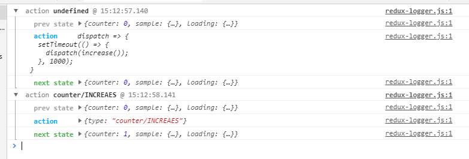
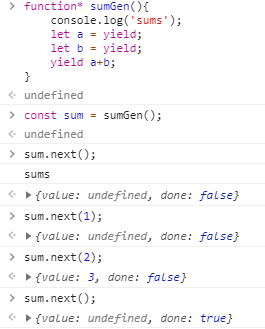
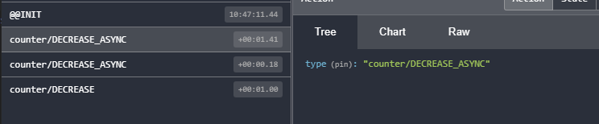
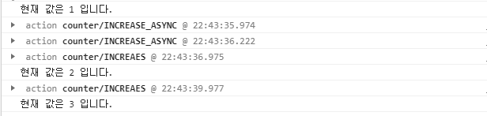

# ✔ 리덕스 미들웨어를 통한 비동기 작업 관리

## 1. 미들웨어란 ❓
> - 리덕스 미들웨어는 액션을 디스패치했을 때 리듀서에서 이를 처리하기에 앞서 사전에 지정된 작업들을 실행한다.
> - 미들웨어는 액션과 리듀서 사이의 중간자
> - 액션 => 미들웨어 => 리듀서 => 스토어
### 1.1 미들웨어 만들기
- 실제로는 직접 만들어서 사용하는 일은 거의 없다.
- 미들웨어의 흐름을 이해하기 위해서 필요.
<pre>
const loggerMiddleware = store => next => action => {
    // 미들웨어 기본구조
}

// 같은 구조
const loggerMiddleware = function loggerMiddleware(store){
    return function(next){
        return function (action){

        }
    }
}
export default loggerMiddleware;
</pre>
- 파라미터로 받아오는 <code>store</code>는 리덕스 스토어 인스턴스이다.
- <code>action</code>은 디스패치된 액션을 가르킨다.
- <code>next</code> 파라미터는 함수형태이며 <code>store.dispatch</code>와 비슷한 역할을 한다. 차이점은 <code>next(action)</code>을 호출하면 그 다음 처리해야 할 미들웨어에게 액션을 넘겨주고 그 다음 미들웨어가 없다면 리듀서에게 액션을 넘겨준다.
- <code>store.dispatch</code>를 사용하면 첫 번째 미들웨어부터 다시 처리한다.
- <code>next</code>를 사용하지 않으면 액션이 리듀서에게 전달되지 않고 액션이 무시된다.
<pre>
const loggerMiddleware = store => next => action => {
    console.group(action && action.type); // 액션 타입으로 log를 그룹화 counter/INCREAES
    console.log("이전 상태",store.getState()); // 이전 상태 {counter: 0}
    console.log("액션",action); // 액션 {type: "counter/INCREAES", payload: Class}
    next(action); //다음 미들웨어 혹은 리듀서에게 전달
    console.log("다음 상태",store.getState());//업데이트된 상태  다음 상태 {counter: 1}
    console.groupEnd(); //그룹끝
    
};
export default loggerMiddleware;
</pre>
<pre>
// index.js
import {createStore, applyMiddleware} from 'redux';
const store = createStore(rootReducer ,applyMiddleware(loggerMiddleware));
</pre>

### 1.2 redux-logger 사용하기
- redux-logger 라이브러리 설치 
<pre>
$ yarn add redux-logger
</pre>
- index.js 수정 
<pre>
import {createStore, applyMiddleware} from 'redux';
import {createLogger} from 'redux-logger';

const logger= createLogger();
const store = createStore(rootReducer ,applyMiddleware(logger));
</pre>

## 2. 비동기 작업을 처리하는 미들웨어 ❗
- <b>redux-thunk</b> 
> 비동기 작업을 처리할 때 가장 많이 사용하고 객체가 아닌 함수 형태의 액션을 디스패치할 수 있게 해준다.
- <b>redux-saga</b>
> 특정 액션이 디스패치되었을 때 정해진 로직에 따라 다른 액션을 디스패치시키는 규칙을 작성하여 비동기 작업을 처리할 수 있게 해준다.

## 2.1 redux-thunk
- redux-thunk 라이브러리 설치
<pre>$ yarn add redux-thunk</pre>
- index.js에서 스토어를 만들 때 redux-thunk를 적용한다.
<pre>
const store = createStore(rootReducer ,applyMiddleware(logger, ReduxThunk));
</pre>

### 2.1.1 Thunk 생성 함수 만들기
- redux-thunk는 액션 생성 함수에서 일반 액션 객체를 반환하는 대신에 <b>함수</b>를 반환한다.
- modules/counter.js에 추가
<pre>
// 1초 뒤에 increase or decrease 함수를 디스패치함
export const increaseAsync = () => dispatch => {
    setTimeout(()=> {
        dispatch(increase());
    },1000);
};

export const decreaseAsync = () => dispatch => {
    setTimeout(()=> {
        dispatch(decrease());
    },1000);
};
</pre>
- redux-thunk 적용 후 처음 디스패치되는 액션은 함수 형태이고, 두 번째 액션은 객체 형태이다.

### 2.1.2 웹 요청 비동기 작업 처리하기
- JSONPlaceHolder 가짜 api 사용
- Promise 기반 웹 클라이언트 axios 사용하기 위해 라이브러리 설치
<pre>
$ yarn add axios
</pre>
- API를 호출하는 함수를 따로 작성
<pre>
import axios from 'axios';

export const getPost = id => axios.get(`http://jsonplaceholder.typicode.com/posts/${id}`);

export const getUsers = id => axios.get(`http://jsonplaceholder.typicode.com/users`);
</pre>

- API를 사용하여 데이터를 받아와 상태를 관리하기 위해 리듀서 생성 (modules/sample.js)
- 그 후 modules/index.js에 리듀서 추가
<pre>
const rootReducer = combineReducers({
    counter,
    sample,
});

export default rootReducer;
</pre>
- 받아온 데이터를 화면에 뿌려주는 컴포넌트 생성 (components/Sample.js)
- 리덕스와 연결고리 역할을 하는 컨테이너 컴포넌트 생성 (container/SampleContainer.js)
- 마지막으로 App.js에서 랜더링
<pre>
const App = () => {
  return (
    < div>
      < SampleContainer/>
    < /div>
  );
};
</pre>

### 2.1.3 리팩토링 작업
- API를 요청해야 할 때 마다 <code>thunk</code>함수를 작성하는 것과 로딩 상태의 리듀서에서 관리하는 작업은 코드와 귀찮은 작업이다.
- 반복되는 로직을 따로 분리하여 처리해서 코드의 양을 줄인다.
- <code>thunk</code> 함수를 한줄로 생성할 수 있게 한다.
- 매개변수 <code>type</code> 값에 따라 값을 정의해준다.
<pre>
// lib/createRequestThunk.js 생성
import {finishLoading,startLoading} from '../modules/loading';

// 사용법 : createRequestThunk("GET_USERS", api.getUsers);
export default function createRequestThunk(type, request){
    // 성공 및 실패 액션 타입을 정의한다.
    const SUCCESS = `${type}_SUCCESS`;
    const FAILURE = `${type}_FAILURE`;
    return params => async dispatch => {
        dispatch({type}); //시작
        try {
            const response = await request(params);
            dispatch({
                type : SUCCESS,
                payload : response.data
            });//성공
        } catch (e) {
            dispatch({
                type : FAILURE,
                payload : e,
                error : true
            });//실패
            throw e;
        }
    }
}

// modules/sample.js 생성
export const getPost = createRequestThunk(GET_POST,api.getPost);
</pre>
- 요청의 로딩 상태를 관리하는 작업 개선 (modules/loading.js)
<pre>
// 액션 생성 함수는 createRequestThunk에서 사용된다.
// 요청을 위한 액션 타입을 payload로 설정한다. (ex> "sample/GET_POST")
export const startLoading = createAction(
    START_LOADING, // type
    requestType => requestType  // payload
);

const loading = handleActions(
    {
        [START_LOADING] : (state,action) => ({
            ...state,
            [action.payload] : true
        }),
    }
)
</pre>
- lib/createRequestThunk.js 에 loading 리덕스 모듈에서 만든 액션 생성 함수 추가
<pre>
dispatch(startLoading(type)); 
dispatch(finishLoading(type));
</pre>
- SampleContainer에서 로딩 상태 조회
<pre>
export default connect(({sample,loading}) => ({
    post : sample.post,
    users : sample.users,
    // loadingPost : sample.loading.GET_POST,
    // loadingUsers : sample.loading.GET_USERS
    // 리팩토링 후
    loadingPost : loading['sample/GET_POST'],  // true or false 값
    loadingUsers : loading['sample/GET_USERS']  // true or false 값
}),
{
    getPost,
    getUsers
}
)(SampleContainer);
</pre>

## 2.2 redux-saga
🔶 redux-saga 사용 시 유용한 점
> - 기존 요청을 취소 처리해야 할 때 (불필요한 중복 요청 방지)
> - 특정 액션이 발생했을 때 다른 액션을 발생시키거나, API 요청 등 리덕스와 관계없는 코드를 실행할 때
> - 웹소켓을 사용할 때
> - API 요청 실패 시 재요청해야 할 떄
### 2.2.1 제너레이터 함수
- 함수를 작셩할 때 함수를 특정 구간에 멈춰 놓을 수 있고, 원할 때 다시 돌아가게 할 수 있다.

> 
 
- 제너레이터 함수 문법 기반으로 비동기 작업을 관리 해준다.
- redux-saga는 디스패치하는 액션을 모니터링해서 <b>그에 따라 필요한 작업을 따로</b> 수행할 수 있는 미들웨어이다.

### 2.2.2 redux-saga 비동기 처리 하기

- redux-saga와 리덕스 개발자 도구 라이브러리 설치
<pre>
$ yarn add redux-saga
$ yarn add redux-devtools-extension
</pre>
- redux-saga에 대한 액션 타입과 액션 생성 함수를 만들고 제너레이터 함수를 만든다.
- 이 제너레이터 함수를 사가(saga)라고 부른다.

<pre>
// modules/counter.js
import {delay, put, takeEvery, takeLatest,throttle} from 'redux-saga/effects';
// 액션 타입
const INCREASE_ASYNC = 'counter/INCREASE_ASYNC';
const DECREASE_ASYNC = 'counter/DECREASE_ASYNC';

// 마우스 클릭 이벤트가 payload 안에 들어가지 않도록 () => undifinded를 두 번째 파라미터로 넣어 준다.
export const increaseAsync = createAction(INCREASE_ASYNC, () => undefined);
export const decreaseAsync = createAction(DECREASE_ASYNC, () => undefined);

function* increaseSaga(){
    yield delay(1000); // 1초 기달린다.
    yield put(increase()); // 특정 액션 디스패치
}

function* decreaseSaga(){
    yield delay(1000); // 1초 기달린다.
    yield put(decrease()); // 특정 액션 디스패치
}

export function* counterSaga(){
    // takeEvery는 들어오는 모든 액션에 대해 특정 작업을 처리해 준다.
    yield takeEvery(INCREASE_ASYNC, increaseSaga);
    
    // takeLatest는 기존에 진행 중이던 작업이 있다면 취소 처리하고
    // 가장 마지막으로 실행된 작업만 수행한다.
    yield takeLatest(DECREASE_ASYNC, decreaseSaga);
}
</pre>

- 루트 사가를 만들어준다.
<pre>
// modules/index.js
export function* rootSaga(){
    // all 함수는 여러 Saga를 합쳐 주는 역할을 한다.
    yield all([counterSaga(),함수,함수]);
}
</pre>

- 스토어에 redux-saga 미들웨어를 적용시켜준다.
<pre>
// index.js
import createSagaMiddleware from 'redux-saga';
import {composeWithDevTools} from 'redux-devtools-extension';
// redux- saga 적용
const logger= createLogger();
const sagaMiddleware = createSagaMiddleware();
// composeWithDevTools 리덕스 개발자 도구 적용
const store = createStore(rootReducer,composeWithDevTools(applyMiddleware(logger,ReduxThunk,sagaMiddleware)));
sagaMiddleware.run(rootSaga);
</pre>

- 실행해서 +1 버튼클릭을 2번하면 <code>takeEvery</code>함수는 액션이 두 번 디스패치되어 두 번 실행하게 된다.
- -1 버튼은 <code>takeLatest</code>를 사용했기 때문에 두 번 디스패치되어도 액션은 한 번 디스패치되어 액션이 중첩되면 기존 것들은 무시하고 <b>가장 마지막 액션만 제대로 처리한다.</b>

> 

### 2.2.3 API호출과 리팩토링
- API호출과 리팩토링 작업은 코드 내용과 주석에 포함되어 있다.
- redux-thunk와 매우 흡사.

### 2.2.4 redux-saga의 기타 기능들
- 사가 내부에서 현재 상태를 조회할 수 있다.
<pre>
// modules/counter.js
function* increaseSaga(){
    yield delay(1000); // 1초 기달린다.
    yield put(increase()); // 특정 액션 디스패치
    // Saga 내부에서 현재 상태를 조회할 수 있다. select
    const number = yield select(state => state.counter); // state는 스토어 상태를 의미
    console.log(`현재 값은 ${number} 입니다.`);
}
</pre>
> 

- 사가가 실행되는 주기를 제한하는 방법.
- <code>takeEvery</code> 대신 <code>throttle</code> 함수를 사용하면 사가가 n초에 단 한 번만 호출되도록 설정할 수 있다.
<pre>
export function* counterSaga(){
    // takeEvery는 들어오는 모든 액션에 대해 특정 작업을 처리해 준다.
    //yield takeEvery(INCREASE_ASYNC, increaseSaga);

    // 첫번째 파라미터 : n초 * 1000
    yield throttle(3000, INCREASE_ASYNC,increaseSaga);
    
    // takeLatest는 기존에 진행 중이던 작업이 있다면 취소 처리하고
    // 가장 마지막으로 실행된 작업만 수행한다.
    yield takeLatest(DECREASE_ASYNC, decreaseSaga);
}
</pre>

✔ redux-saga 메뉴얼 참고 : http://redux-saga.js.org/
