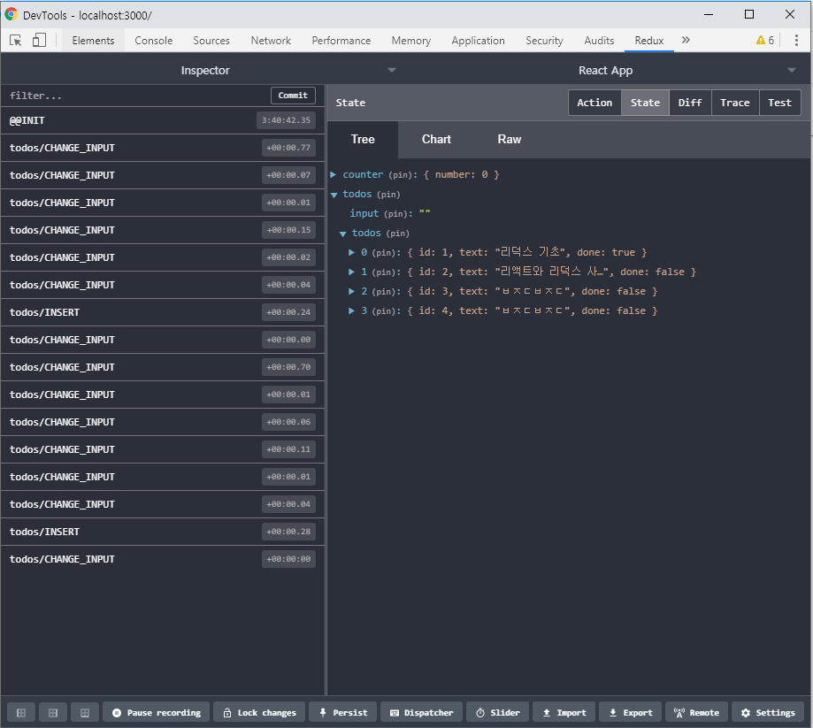

# ※ 리덕스를 사용하여 리액트 애플리케이션 상태 관리하기

## 1. 작업 환경 설정하기
- 리액트 애플리케이션에서 리덕스를 사용하면, 상태 업데이트에 관한 로직을 모듈로 따로 분리하여 컴포넌트 파일과 별개로 관리할 수 있으므로 유지 보수에 용이하다.
- 리덕스를 사용할 때 react-redux라는 라이브러리에서 제공하는 유틸 함수(connect)와 컴포넌트(Provider)를 사용하여 처리한다.
- <b>리덕스와 react-redux 라이브러리 설치</b>
<pre>
$ yarn add redux react-redux
</pre>
- 리덕스를 사용할 떄 가장 많이 사용하는 패턴은 <b>프레젠테이셔널 컴포넌트</b>와 <b>컨테이너 컴포넌트</b>를 분리하는 것이다.
- <b>프레젠테이셔널 컴포넌트</b>란 주로 상태 관리가 이루어지지 않고, <code>props</code>를 받아 와서 UI를 보여 주기만 하는 컴포넌트 (src/components)
- <b>컨테이너 컴포넌트</b>는 리덕스와 연동되어 있는 컴포넌트로 리덕스로부터 상태를 받아오기도 하고 리덕스 스토어에 액션을 디스패치하기도 한다.(src/container)

## 2. 리덕스 관련 코드 작성하기
### 2.1 일반적인 구조
- 액션 타입, 액션 생성 함수, 리듀서 코드를 세 개의 다른 디렉터리에 따로 만드는 방식.
### 2.2 Ducks 패턴
- 액션 타입, 액션 생성 함수, 리듀서 코드를 파일 하나에 몰아서 작성하는 방법.
### 2.3 초기 상태 및 리듀서 함수 만들기
- 이 설명은 [vanilla-redux](https://github.com/saseungmin/react-tutorial/tree/master/vanilla-redux)에 적혀있음.
- 액션 생성 함수는 <code>export</code>로 내보내 주었다.
<pre>
export const increase = () => ({ type: INCREASE });
</pre>
- <code>export</code>는 여러 개를 내보낼 수 있지만 <code>export default</code>는 단 한 개만 내보낼수 있다.
- 불러오는 방식도 <code>export</code>는 <code>import {changeInput} from '../modules/todos';</code> <code>{}</code>를 사용해서 불러오고 <code>export default</code>는 <code>import counter from './counter'</code>방식으로 불러온다.

### 2.4 루트 리듀서 만들기
- <code>createStore</code>함수를 사용하여 스토어를 만들 때는 리듀서를 하나만 사용해야한다. 떄문에 여러 개의 리듀서를 만들시에 하나로 합쳐줘야 하는데 그때는 리덕스에서 제공하는 <code>combineReducers</code>라는 유틸 함수를 사용한다.
<pre>
// modules/index.js
import { combineReducers } from 'redux';
// 하나의 리듀서로 합치기
const rootReducer = combineReducers({
  counter,
  todos,
});
</pre>

## 3. 리액트 애플리케이션에 리덕스 적용하기
### 3.1 스토어 만들기
<pre>
// src/index.js
import {createStore} from 'redux';
import rootReducer from './modules';
// 스토어 생성
const store = createStore(rootReducer);
</pre>
### 3.2 Provider 컴포넌트를 사용하여 프로젝트에 리덕스 적용하기
<pre>
// src/index.js
import {Provider} from 'react-redux';
// Provider 컴포넌트 사용하여 프로젝트에 리덕스 적용
// App 컴포넌트를 Provider 컴포넌트로 감싸준다. => store를 props로 전달해 줘야한다.
ReactDOM.render(
  < Provider store={store}>
    < App />
  < /Provider>,
  document.getElementById('root')
);
</pre>

### 3.3 Redux DevTools 설치
- 리덕스 개발자 도구이며, 크롬 확장 프로그램으로 설치하여 사용가능.
<pre>
// redux-devtools-extension 패키지 설치
$ yarn add redux-devtools-extension
// src/index.js
import {composeWithDevTools} from 'redux-devtools-extension';
const store = createStore(rootReducer, composeWithDevTools());
</pre>
- Redux DevTools

 

## 4. 컨테이너 컴포넌트 만들기
- 컨테이너 컴포넌트 : 리덕스 스토어와 연동된 컴포넌트
- 리덕스와 연동하려면 react-redux에서 제공하는 <code>connect</code> 함수를 사용해야 한다.
### 4.1 mapStateToProps와 mapDispatchToProps 미리 선언하는 방법
<pre>
// containers/CounterContainer.js
import { connect } from 'react-redux';

const CounterContainer = ({ number, increase, decrease }) => {
  return (
    < Counter number={number} onIncrease={increase} onDecrease={decrease} />
  );
};

const mapStateToProps = (state) => ({
  number: state.counter.number,
});
dispatch를 감싸는 작업이 번거로울 수 있다.
const mapDispatchToProps = dispatch => ({
    increase: () => {
        dispatch(increase());
    },
    decrease: () => {
        dispatch(decrease());
    }
});

// mapStateToProps, mapDispatchToProps에 반환하는 객체 내부의 값들은 컴포넌트의 props로 전달된다.
// mapStateToProps는 state를 파라미터로 받아온다. 이 값은 현재 스토어가 지니고 있는 상태를 가리킨다.
// mapDispatchToProps는 store의 내장 함수 dispatch를 파라미터로 받아온다.
export default connect(mapStateToProps, mapDispatchToProps)(CounterContainer);

</pre>

### 4.2 connect 함수 내부에 익명 함수 형태로 선언
<pre>
익명 함수 형태로도 사용가능.
export default connect(
    state => ({
        number:state.counter.number
    }),
    dispatch => ({
        increase: () => {
            dispatch(increase());
        },
        decrease: () => {
            dispatch(decrease());
        }
    })
)(CounterContainer);
</pre>

### 4.3 bindActionCreators 유틸 함수를 사용한 방법
- 리덕스에서 제공하는 유틸 함수를 사용한 방법으로 <code>dispatch</code>로 감싸는 작업이 번거롭다.
<pre>
import { bindActionCreators } from 'redux';

bindActionCreators 사용
const mapDispatchToProps = (dispatch) =>
  bindActionCreators(
    {
      increase,
      decrease,
    },
    dispatch,
  );
</pre>

### 4.4 mapDispatchToProps를 객채 형태로 넣어 주는 방법
- mapDispatchToProps에 해당하는 파라미터를 함수 형태가 아닌 액션 생성 함수로 이루어진 객체 형태로 넣어 준다.
- 객체 형태로 넣어 주면 <code>connect</code>함수가 내부적으로 <code>bindActionCreators</code> 작업을 대신 수행한다.
<pre>
export default connect(
    state => ({
        number:state.counter.number
    }),
    {
        increase,
        decrease,
    }
)(CounterContainer);
</pre>

## 5. 리덕스를 더 편하게 사용하기
- 액션 생성 함수, 리듀서를 작성할 때 <code>redux-actions</code>라이브러리 사용
- <code>immer</code> 라이브러리 사용
### 5.1 redux-actions
- 리듀서를 작성할 때 <code>switch/case</code> 대신 <code>handleActions</code> 사용
- redux-actions 라이브러리 설치
<pre>
$ yarn add redux-actions
</pre>
<pre>
import {createAction, handleActions} from 'redux-actions';

// 액션 타임 정의
const INCREASE = 'counter/INCREASE';
const DECREASE = 'counter/DECREASE';

//redux-actions사용해서 액션 생성 함수 만들기
export const increase = createAction(INCREASE);
export const decrease = createAction(DECREASE);

// 초기 상태 및 리듀서 함수 만들기
const initialState = {
  number: 0,
};

//redux-actions handleActions 함수 사용해서 리듀서 함수 만들기
// 첫번째 파라미터에는 각 액션에 대한 업데이트 함수를 넣어주고, 두 번쨰 파라미터에는 초기 상태를 넣어준다.
const counter = handleActions(
    {
        [INCREASE] : (state, action) => ({number:state.number+1}),
        [DECREASE] : (state, action) => ({number:state.number-1}),
    },
    initialState,
)
</pre>

- 액션 생성 함수에 파라미터가 필요할 때
- <code>createAction</code>으로 액션을 만들면 역션에 필요한 추가 데이터는 payload라는 이름을 사용.
<pre>
export const insert = createAction(INSERT, text => ({
    id : id++,
    text,
    done: false,
}));
</pre>
- 액션 생성 함수에서 파라미터로 받아 온 값은 <code>action.payload</code>로 공통적으로 넣어 주게 된다.
<pre>
const todos = handleActions(
    {
        [INSERT] : (state,action) => ({
            ...state,
            todos: state.todos.concat(action.payload)
        }),
    }
)
</pre>
- payload라는 이름이 다 같기 때문에 헷갈릴 수 있다.
- 비구조화 할당 문법으로 이름을 새로 설정
<pre>
    {
        [INSERT] : (state,{payload : todo}) => ({
            ...state,
            todos: state.todos.concat(todo)
        }),
    }
</pre>

### 5.2 immer 사용
- 리듀서에서 상태를 업데이트할 때 불변성을 지켜야 한다.
- 모듈의 상태가 복잡해질수록 불변성을 지키기가 어렵다.
<pre>
// immer 라이브러리 설치 
$ yarn add immer
</pre>
- 적용
<pre>
// modules/todos.js
import  produce from 'immer';

const todos = handleActions(
    [INSERT] : (state,{payload : todo}) => 
    produce(state,draft => {
        draft.todos.push(todo);
    }),
)
</pre>

## 6. Hooks를 사용하여 컨테이너 컴포넌트 만들기
### 6.1 useSelector로 상태 조회하기
- <code>useSelector</code>  Hook를 사용하면 <code>connect</code>함수를 사용하지 않고도 리덕스 상태를 조회할 수 있다.
<pre>
import { useSelector } from 'react-redux';

// hooks useSelector를 사용하여 리덕스 상태 조회
const number = useSelector(state => state.counter.number);

</pre>

### 6.2 useDispatch를 사용하여 액션 디스패치하기
- 숫자가 업데이트 될때마다 리렌더링이 되기때문에 <code>useCallback</code>으로 액션을 디스패치하는 함수를 감싸준다.
<pre>
import { useDispatch } from 'react-redux';

// useDispatch를 사용하여 액션 디스패치하기
const dispatch = useDispatch();

// useCallback을 사용해서 리렌더링 방지하기.
// useDispatch를 사용할땐 useCallback과 같이 사용한다.
const onIncrease = useCallback(() => dispatch(increase()),[dispatch]);
const onDecrease = useCallback(() => dispatch(decrease()),[dispatch]);
</pre>

### 6.3 useAction 유틸 Hook 만들어서 사용하기
- 원래 <code>useAction</code>는 react-redux에 내장된 상태로 릴리즈될 계획이나 필요하지 않다는 판단으로 제외되었다. 그 대신 공식 문서에서 그대로 복사하여 사용가능하다.
- 참고링크 : (https://react-redux.js.org/api/hooks#removed-useactions)
- _"이 후크는 원래 알파 릴리스에 있었지만 Dan Abramov의 제안 v7.1.0-alpha.4 에 따라에서 제거되었습니다 .   <code>useDispatch</code>대한 참조를 검색하고 필요에 따라 콜백 및 효과를 <code>dispatch</code>수동으로 호출하려면 구성 요소 의 Hook를 호출하는 것이 좋습니다.   이 Hook를 직접 사용하려면 액션 작성자를 단일 함수, 배열 또는 객체로 전달하는 것을 지원하는 복사 가능 버전이 있습니다."_
- 여러 개의 액션을 사용해야 하는 경우 코드가 깔끔해진다.
<pre>
// lib/useActions.js
import {bindActionCreators} from 'redux';
import {useDispatch} from 'react-redux';
import {useMemo} from 'react';

// 액션 생성 함수를 액션을 디스패치하는 함수로 변환해 준다.
// 액션 생성 함수를 사용하여 액션 객체를 만들고, 이를 스토어에 디스패치하는 작업을 해 주는 함수를 자동으로 만들어 준다.
// 첫 번째 파라미터는 액션 생성 함수로 이루어진 배열.
// 두 번째 파라미터는 deps 배열이며, 이 배열 안에 들어 있는 원소가 바뀌면 액션을 디스패치하는 함수를 새로 만든다.
export default function useAction(action, deps){
    const dispatch = useDispatch();
    return useMemo(
        ()=>{
            if(Array.isArray(action)){
                return action.map(a => bindActionCreators(a,dispatch));
            }
            return bindActionCreators(action,dispatch);
        },
        deps ? [dispatch,...deps] : deps
    );
}

// containers/TodoContainer.js
import useActions from '../lib/useAction';

// useActions 유틸 Hook을 만들어서 사용하기.
const [onChangeInput,onInsert,onToggle,onRemove] = useActions(
    [changeInput,insert,toggle,remove],[]
)
</pre>

### 6.4 connect 함수와의 차이점
- <code>connect</code>함수를 사용하여 컨테이너 컴포넌트를 만들었을 경우, 해당 컴포넌트의 부모 컴포넌트가 리렌더링될 때 해당 컨테이너 컴포넌트의 <code>props</code>가 바뀌지 않았다면 <b>리렌더링이 자동으로 방지</b>되어 성능이 최적화 된다.
- 반면, <code>useSelector</code>를 사용해서 <b>리덕스 상태를 조회했을 겅우 최적화 작업이 자동으로 이루어지지 않아서</b> <code>React.memo</code>를 컨테이너 컴포넌트에 사용해주어야 한다.
<pre>
export default React.memo(TodosContainer);
</pre>