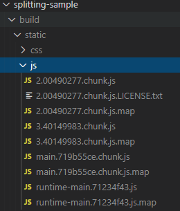

# ✔ 코드 스플리팅

> - 리액트 프로젝트를 완성 후 사용자에게 제공할 때는 빌드 작업을 거쳐서 배포를 하는데 이 빌드 작업을 통해 자바스크립트 파일 안에서 불필요한 주석, 경고 메시지, 공백등을 제거하여 파일 크기를 최소화하기도 하고, 브라우저에서 JSX 문법이나 다른 최신 자바스크립트 문법이 원활하게 실행되도록 코드의 트랜스파일 작업을 한다.

> - 위 작업을 웹팩(webpack)이 담당하는데 웹팩에서 별도의 설정을 하지 않으면 모든 자바스크립트 파일이 하나의 파일로 합쳐지고, 모든 CSS 파일도 하나 파일로 합쳐진다.

> - CRA로 프로젝트를 빌드할 경우 최소 두 개 이상의 자바스크립트 파일이 생성되는데 CRA 기본 웹팩 설정에는 SplitChunks 라는 기능이 적용되어 node-modules에서 불러온 파일들을 자동으로 따로 분리시켜서 캐싱의 효과를 제대로 누릴 수 있게 해준다.

<pre>
$ yarn build
</pre>
- 빌드 후 프로젝트 디렉터리 안에 build 파일 생성

> 

- 2로 시작하는 파일에는 <code>React</code>, <code>ReactDOM</code> 등 node_modules에서 불러온 라이브러리 관련 코드가 들어있다.
- main으로 시작하는 파일에는 직접 프로젝트에 작성되는 App 같은 컴포넌트에 대한 코드가 들어 있다.
- SplitChunk라는 웹팩 기능을 통해 자주 바뀌지 않는 코드들이 2로 시작하는 파일에 들어 있기 때문에 캐싱의 이점을 누릴 수 있다.
> App.js 를 수정 후 <code>yarn build</code>를 다시하면 main으로 시작하는 파일의 이름이 변경된다.
- 이렇게 파일을 분리하는 작업을 <b>코드 스플리팅</b>이라고 한다.

## 1. 자바스크립트 함수 비동기 로딩
- src/notify.js 파일 생성
<pre>
export default function notify(){
    alert('안녕하세요!');
}
</pre>
- App.js
<pre>
import notify from './notify';

function App() {
    const onClick = () => {
    notify();
    }
const onClick = () => {
    import('./notify').then(result => result.default());
}
return (
    // 생략
        < p onClick={onClick}>hello react!< /p>
);
}

</pre>

- <code>build</code> 할 때 <code>main</code>안에 안들어가고 파일을 분리시켜서 따로 저장된다.
- 실제 함수가 필요한 지점에 파일을 불러와서 함수를 사용할 수 있다. 
- <code>import</code>를 함수로 사용하면 <code>Promise</code>를 반환한다. => 표준 자바스크립트는 아님(<code>dynamic import</code>라는 문법)
- <code>build/static/js/3</code>으로 시작하는 파일에 <code>notify.js</code>의 코드가 따로 분리되어 저장된다.

## 2. React.lazy와 Suspense를 통한 컴포넌트 코드 스플리팅
- 리액트 16.6 버전부터 도입.
> 이전 버전에서는 <code>import</code> 함수를 통해 불러온 다음, 컴포넌트 자체를 <code>state</code>에 넣는 방식으로 구현해야 된다. => 조금은 불편한 방식.

- 코드 스플리팅을 할 간단한 컴포넌트 생성
<pre>
import React from 'react';
const SplitMe = () => {
    return (
        < div>SplitMe< /div>
    );
};
export default SplitMe;
</pre>

- <code>React.lazy</code>는 컴포넌트를 렌더링하는 시점에서 비동기적으로 로딩할 수 있게 해 주는 유틸 함수이다.
- <code>Suspense</code>는 리액트 내장 컴포넌트로서 코드 스플리팅된 컴포넌트를 로딩하도록 발동시킬 수 있고, 로딩이 끝나지 않았을 때 보여줄 UI를 설정할 수 있다.
- <code>Suspense</code>는 <code>fallback props</code>를 통해 로딩 중에 보여줄 JSX를 지정할 수 있다.
<pre>
// App.js
<b>const SplitMe = React.lazy(() => import('./SplitMe'));</b>

const App = () => {
  const [visible, setVisible] = useState(false);
  const onClick = () => {
    setVisible(true);
  }
  return (
    < div className="App">
      < header className="App-header">
        < img src={logo} className="App-logo" alt="logo" />
        < p onClick={onClick}>hello react!< /p>
        <b>< Suspense fallback={< div>loading...</ div>}></b>
          {visible && < SplitMe/>}
        <b>< /Suspense></b>
      < /header>
    < /div>
  );
};
</pre>

- 공식 문서 참고 : https://reactjs.org/docs/code-splitting.html#reactlazy

## 3. Loadable Components를 통한 코드 스플리팅
- Loadable Components는 코드 스플리팅을 편하게 하도록 도와주는 서드파티 라이브러리.
- 이 라이브러리의 이점은 <b>서버 사이드 렌더링</b>을 지원한다는 점 (React.lazy와 Suspense는 아직 서버 사이드 렌더링을 지원하지 않는다.) 
또한, 렌더링하기 전에 필요할 때 스플리팅된 파일을 미리 불러올 수 있는 기능도 있다.
> 서버 사이드 렌더링이란❓  
웹 서비스의 초기 로딩 속도 개선, 캐싱 및 검색 엔진 최적화를 가능하게 해 주는 기술이다. 
서버 사이드 렌더링을 사용하면 웹 서비스의 초기 렌더링을 사용자의 브라우저가 아닌 서버 쪽에서 처리해준다.

- <code>Loadable Components</code> 라이브러리 설치
<pre>
$ yarn add @loadable/component
</pre>
- <code>React.lazy</code>와 비슷하고, <code>Suspense</code>를 사용하지 않는다.
<pre>
// 두 번째 인자에 fallback 함수를 넣어 로딩 중에 다른 UI를 보여줄 수 있다.
const SplitMe = loadable(() => import('./SplitMe'),{
  fallback : < div>loading...< /div>
});
</pre>
- <code>Loadable Components</code>의 컴포넌트를 미리 불러오는(preload) 방법
- 마우스 커서를 올리기만 해도 로딩이 시작된고 클릭시 랜더링된다. => 개발자 도구 network 페이지에서 확인 가능
<pre>
const App = () => {
  // 생략..
  // loadable component에서 컴포넌트를 미리 불러오는 방법
  const onMouseOver = () => {
    SplitMe.preload();
  }
  return (
      //생략..
      < p onClick={onClick} onMouseOver={onMouseOver}>hello react!< /p>
      {visible && < SplitMe/>}
  );
};
</pre>

- 이런 기능들 외에도 타임아웃, 로딩 UI 딜레이, 서버 사이드 렌더링 호환 등 다양한 기능을 제공한다.
- 공식 문서 참고 : https://loadable-components.com/docs/getting-started/