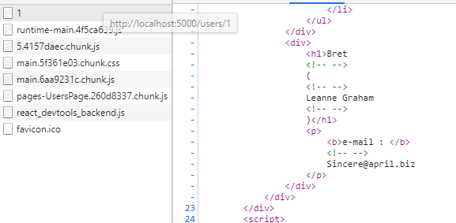
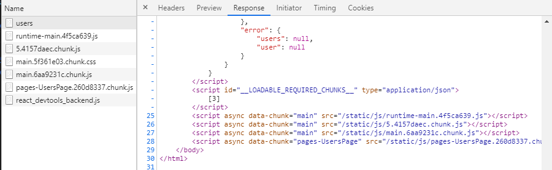

# ✔ 서버 사이드 렌더링
> 서버 사이드 렌더링은 UI를 서버에서 렌더링하는 것을 의미하고 초기 렌더링을 서버쪽에서 대신해준다.

✒ 서버 사이드 렌더링 장점
> - 구글, 네이버 같은 검색 엔진이 페이지를 원활하게 수집할 수 있다.
> - 초기 렌더링 성능을 개선할 수 있다.

✒ 서버 사이드 렌더링 단점
> - 원래 브라우저가 해야 할 일을 서버가 대신 처리하는 것이므로 서버 리소스가 사용된다.
> - 사용자 많아지면 캐싱과 로드 밸런싱을 통해 성능 최적화를 해줘야 한다.
> - 프로젝트 구조 복잡, 데이터 미리 불러오기, 코드 스플리팅과의 호환(Loadable Components 사용)등을 고려해야되서 개발이 복잡해진다.

✒ reaact-router-dom 설치
<pre>$ yarn add react-router-dom</pre>

✒ 컴포넌트와 페이지 컴포넌트 만들기
- 생략(소스코드 참고)

##  1. 서버 사이드 렌더링 구현
- 웹팩 설정을 커스터마이징해야한다.
<pre>
$ git add .
$ git commit -m 'Commit'
// 웹팩 관련 설정 꺼내기
$ yarn eject
</pre>

### 1.2 엔트리 만들기
- 엔트리는 웹팩에서 프로젝트를 불러올 떄 가장 먼저 불러오는 파일
- <code>index.server.js</code> 참고 
<pre>
// 서버에서 리액트 컴포넌트를 렌더링할 때 ReactDOMServer.renderToString 사용
const html = ReactDOMServer.renderToString(
    < div> start ssr< /div>
)
console.log(html);
</pre>

### 1.3 웹팩 환경 설정 작성
📌 config/paths.js에 <code>module.exports</code> ⬅ 수정
<pre>
  ssrIndexJs: resolveApp('src/index.server.js'), // 서버 사이드 렌더링 엔트리
  ssrBuild: resolveApp('dist'), // 웹팩 처리 후 저장 경로
</pre>

📌 config/webpack.config.server.js 생성
<pre>
// 기본 설정
const paths = require('./paths');

module.exports = {
  mode: 'production',  // 프로덕션 모드로 설적하여 최적화 옵션들을 활성화
  entry: paths.ssrIndexJs, //엔트리 경로
  target: 'node', // node 환경에서 실행될 것이라는 것을 알려주기 위해서
  output: {
    path: paths.ssrBuild, //빌드이름
    filename: 'server.js', //파일이름
    chunkFilename: 'js/[name].chunk.js',  //청크 파일 이름
    publicPath: paths.publicUrlOrPath //정적 파일이 제공될 경로
  },
}
</pre>

-  로더를 설정한다.
> 웹팩의 로더는 파일을 불러올 때 확장자에 맞게 필요한 처리를 해준다.
<pre>
config/webpack.config.server.js 참고
module: {
    rules: [
      {
        oneOf: [
            // 생략 
        ]
      }
    ]
}
</pre>

-  <code>node_modules</code> 내부의 라이브러리를 불러올 수 있게 설정
<pre>
  resolve: {
    modules: ['node_modules']
  }, 
</pre>
- 위와 같이 했을 때, <code>react</code>,<code>react-dom/server</code> 같은 라이브러리를 <code>import</code> 구문으로 불러오면 <code>node_modules</code>에서 찾아 사용한다.
- 서버를 위해 번들링할 때는 <code>node_modules</code>에서 불러오는 것을 제외하고 번들링하는 것이 좋다. 이를 위해, <code>webpack-node-externals</code>라이브러리 사용한다.
<pre>
$ yarn add webpack-node-externals

// webpack-node-externals 적용
const nodeExternals = require('webpack-node-externals');
externals: [nodeExternals()], // node-modules에서 불러오는 것을 제외하고 번들링하기
</pre>

- 환경 변수 주입하기
<pre>
const webpack = require('webpack');
const getClientEnvironment = require('./env');

const env = getClientEnvironment(paths.publicUrlOrPath.slice(0,-1));

(...)
// 프로젝트 내에서 process.env.NODE_ENV 값을 참조하여 현재 개발 환경인지 아닌지를 알 수 있다.
plugins: [
    new webpack.DefinePlugin(env.stringified) // 환경변수를 주입
]
</pre>

### 1.4 빌드 스크립트 작성하기
- 만든 환경 설정을 사용하여 웹팩으로 프로젝트를 빌드하는 스크립트 작성
- scripts/build.server.js 작성 후 명령어 실행
<pre>
$ node scripts/build.server.js
// 실행 후
$ node dist/server.js
</pre>
- package.json scripts 수정
<pre>
  "scripts": {
      // 생략
    "start:server": "node dist/server.js",
    "build:server": "node scripts/build.server.js"
  },
</pre>
- 명령어로 실행
<pre>
$ yarn build:server
$ yarn start:server
</pre>

### 1.5 서버 코드 작성하기
- <code>Express</code> Node.js 웹 프레임워크 사용
<pre>
$ yarn add express
</pre>
- index.server.js 수정(주석 참고)
- 서버 사이드 렌더링 용도로 사용하는 라우터로 <code>props</code>로 넣어 주는 <code>location</code> 값에 따라 라우팅되고 <code>req.url</code>는 요청에 대한 정보를 지니고있다. 또한, <code>context</code>는 HTTP 상태 코드를 설정해 줄 수 있다.
<pre>
< StaticRouter location={req.url} context={context}>
    < App/>
< /StaticRouter>
</pre>

### 1.6 정적 파일 제공하기
- index.server.js 수정(주석 참고)
<pre>
// static 미들웨어를 사용하여 서버를 통해 build에 있는 Js,Css 정적 파일들에 접근할 수 있도록 해준다.
const serve = express.static(path.resolve('./build'),{
    index : false // "/" 경로에서 index.html을 보여주지 않도록 설정
})

app.use(serve); //순서 중요!  serverRender 전에 위치해야한다.
app.use(serverRender);
</pre>

- JS와 CSS 파일을 불러오도록 html에 코드를 삽입해 주어야 한다.
- <code>asset-manifest.json</code>을 참고하며 작성한다.
- index.server.js 수정(주석 참고)

<pre>
import fs from 'fs';

// build/asset-manifest.json에서 파일 경로들을 조회한다.
const manifest = JSON.parse(
    fs.readFileSync(path.resolve('./build/asset-manifest.json'),'utf-8')
);

const chunks= Object.keys(manifest.files).filter(key => /chunks\.js$/.exec(key)) // chunks.js로 끝나는 키를 찾는다.
        .map(key => `< script src= "${manifest.files[key]}">< /script>`)// 스크립트 태그로 변환
        .join(''); //각 배열을 합친다.

function createPage(root){
    return  `생략...`
}
</pre>

- 개발자 도구 Network 탭에서 확인해서 링크를 눌렀을때 클라이언트 렌더링이 되야한다. 즉, 다른 링크를 클릭하여 다른 페이지로 이동할 때 네트워크 요청이 추가로 발생하면 안된다.
- 첫 번째 렌더링은 서버에서 하지만, 그 이후는 브라우저에서 처리한다.

## 2. redux-thunk 미들웨어를 사용한 데이터 로딩
- redux-thunk를 사용하여 API 호출
<pre>
$ yarn add redux react-redux redux-thunk axios
</pre>

> - 액션 타입, 액션 생성 함수, 리듀서 코드를 한 파일에 넣어서 관리하는 Ducks 패턴 사용
>   - modules/users.js에 작성
> - 루트 리듀서 생성 후, <code>Provider</code> 컴포넌트를 사용하여 프로젝트에 리덕스 적용
>   - modules/index.js 와 src/index.js
> - Users, UsersContainer 생성 (사용자에 대한 정보를 보여줄 컴포넌트)
>   - components/Users.js 와 src/containers/UsersContainer.js

📌 서버 사이드 렌더링을 할 떄는 <b>이미 있는 정보를 재요청하지 않게</b> 처리하는 작업이 중요하다. 이 작업을 하지 않으면 브라우저에서 페이지를 확인할 때 데이터가 있음에도 불구하고 불필요한 API를 호출하게 된다.
> - 페이지 컴포넌트 생성 후, 라우트 설정
>   - pages/UsersPage.js 와 App.js 라우트 추가
> - 경로 설정
>   - components/Menu.js 수정

### 2.1 PreloadContext 만들기
- 서버 사이드 렌더링을 할 때는 <code>useEffect</code>나 <code>componentDidMount</code>에서 설정한 작업이 호출되지 않는다.
- 때문에 렌더링 하기전에 API를 요청한 뒤 스토어에 데이터를 담아야한다.

✒ <b>lib/PreloadContext.js 생성 (주석 확인)</b>
>  - PreloadContext는 서버 사이드 렌더링을 하는 과정에서 처리해야할 작업들을 실행하고, 만약 기다려야 하는 <code>promise</code>가 있다면 프로미스를 수집한다.
>  - 모든 <code>promise</code>를 수집하고, <code>promise</code>들이 끝날 때까지 기다렸다가 그 다음에 렌더링하면 <b>데이터가 채워진 상태</b>로 컴포넌트들이 나타나게 된다.
>  - container/UserContainer.js 수정 <code>< Preloader resolve={getUsers}/></code>

### 2.2 서버에서 리덕스 설정 및 PreloadContext 사용하기
- 브라우저에서 할 떄와 동일하게 리덕스 생성 (index.server.js)
- <b>주의❗</b> 서버가 실행될 때 스토어를 한 번만 만드는 것이 아니라, <b>요청이 들어올 떄마다 새로운 스토어를 생성한다.</b>
- <code>PreloadContext</code>를 사용하여 프로미스들을 수집하고 기달렸다가 다시 렌더링시키는 작업

<pre>
import PreloadContext from './lib/PreloadContext';
// 생략
const serverRender = async (req, res, next) => {
// 생략
    const preloadContext = {
      done : false,
      promises : []
    }
    const jsx = (
        < PreloadContext.Provider value={preloadContext}>
        // 생략..
        < /PreloadContext.Provider>
    );

    ReactDOMServer.renderToStaticMarkup(jsx);
    try {
      await Promise.all(preloadContext.promises); // 모든 프로미스를 기달린다.
    } catch (e) {
      return res.status(500);
    }
    preloadContext.done = true;
    // 서버에서 리액트 컴포넌트를 렌더링할 때 ReactDOMServer.renderToString 사용
    const root = ReactDOMServer.renderToString(jsx); //렌더링
}
</pre>

> - 첫 번째 렌더링 할 떄는 <code>renderToStaticMarkup</code> 함수를 사용했다.
> - <code>renderToStaticMarkup</code>은 리액트를 사용하여 정적인 페이지를 만들 때 사용한다.
> - 이 함수로 만든 리액트 렌더링 결과물은 클라이언트 쪽에서 HTML DOM 인터랙션을 지원하기 힘들다.
> - <code>renderToString</code> 대신 <code>renderToStaticMarkup</code> 함수를 사용한 이유는 <code>Preloader</code>로 넣어 주었던 함수를 호출하기 위해서이다. 또 한, 이 함수의 처리 속도가 <code>renderToString</code> 보다 좀 더 빠르다. 

### 2.3 스크립트로 스토어 초기 상태 주입하기.
- 작성한 코드는 API를 통해 받아 온 테이터를 렌더링하지만, 렌더링하는 과정에서 만들어진 스토어의 상태를 브라우저에서 재사용하지 못한다.
- 서버에서 만들어준 상태를 브라우저에서 재사용하려면 현재 스토어 상태를 <b>문자열로 반환한 뒤 스크립트로 주입</b>해 주어야 한다.
- index.server.js 수정
<pre>
function createPage(root, stateScript){
// 생략
${stateScript}
// 생략
}
const serverRender = async (req, res, next) => {
// 생략
const root = ReactDOMServer.renderToString(jsx); //렌더링
const stateString = JSON.stringify(store.getState()).replace(/< /g, '\\u003c');
const stateScript = `< script>__PRELOADED_STATE__ = ${stateString}< /script>`; //리덕스 초기 상태를 스크립트로 주입
res.send(createPage(root,stateScript)); //클라이언트에게 결과물 응답.
}
</pre>
> 🔶 위 과정에서 JSON을 문자로 변환하고 악성 스크립트가 실행되는 것을 방지하기 위해 <를 치환 처리 해준다. 
> 📌 참고 문서 : https://redux.js.org/recipes/server-rendering#security-considerations

- 브라우저에서 상태를 재사용할 때는 스토어 생성 과정에서 <code>window.__ PRELOADED_STATE__</code>를 초깃값으로 사용하면 된다.
<pre>
//index.js
const store =createStore(
  rootReducer,
  window.__PRELOADED_STATE__, // 이름 그대로 이 값을 초기 상태로 사용함
  applyMiddleware(thunk),
  );
</pre>

- 빌드 후 서버를 실행 (http://localhost:5000/users)
<pre>
$ yarn build
$ yarn build:server
$ yarn start:server
</pre>

## 3. redux-saga를 사용한 서버 사이드 렌더링
- redux-saga 라이브러리 설치
<pre>$ yarn add redux-saga</pre>
- redux-saga를 이용한 modules/users.js 에 특정 사용자 정보를 가져오는 소스 추가
- modules/index.js에 redux-saga의 루트 사가를 적용한다.
<pre>
export function* rootSaga(){
    yield all([usersSaga()]);
}
</pre>
- 스토어 생성할 때 미들웨어를 적용
<pre>
const store =createStore(
  rootReducer,
  window.__PRELOADED_STATE__, // 이름 그대로 이 값을 초기 상태로 사용함
  applyMiddleware(thunk, sagaMiddleware),
);

sagaMiddleware.run(rootSaga);
</pre>

#### ✒ User, UserContainer 컴포넌트 생성
- components/User.js 생성
- 컨테이너 컨포넌트를 <code>connect</code>함수 대신, <code>useSelector</code>와 <code>useDispatch</code> Hooks를 사용해 만든다.
- 서버 사이드 렌더링을 해야 하기 때문에 <code>null</code> 이 아닌 <code>Preloader</code> 컴포넌트를 렌더링하여 반환한다.
<pre>
if(!user){
    return < Preloader resolve={() => dispatch(getUser(id))}/>
}
</pre>
- 이렇게 해주면 서버 사이드 렌더링을 하는 과정에서 데이터가 없을 경우 <code>GET_USER</code> 액션을 발생시킨다.

- pages/UserPage.js에 Route 설정하기

### 3.1 redux-saga를 위한 서버 사이드 렌더링 작업
- redux-thunk를 사용하면 <code>Preloader</code>를 통해 호출한 함수들이 <code>Promise</code>를 반환하지만, redux-saga는 <code>Promise</code>를 반환하지 않기 때문에 추가 작업이 필요하다.
- index.server.js 엔트리 파일에도 redux-saga 미들웨어 적용한다.
- <code>toPromise</code>를 통해 <code>sagaMiddleware.run</code>을 통해 만든 Task를 <code>Promise</code>로 변환한다.
- 별도의 작업을 하지 않으면 <code>Promise</code>는 끝나지 않는다. 이유는 <b>루트 사가에서 액션을 끝없이 모니터링 하기 때문이다.</b>
<pre>
const sagaPromise = sagaMiddleware.run(rootSaga).toPromise();
</pre>
- 그래서 <code>END</code> 액션을 발생시키면 액션 모니터링 작업이 종료되고, 모니터링되기 전에 시작된 <code>getUserSaga</code>와 같은 사가 함수들이 있다면 해당 함수들이 완료되고 나서 <code>Promise</code>가 종료되게 된다.
- 이 <code>Promise</code>가 끝나는 시점에 리덕스 스토어는 데이터가 채워진다.
<pre>
store.dispatch(END);
try {
      await sagaPromise; // 기존에 진행 중이던 사가들이 모드 끝날 때까지 기달린다.
      await Promise.all(preloadContext.promises); // 모든 프로미스를 기달린다.
    } catch (e) {
      return res.status(500);
}
</pre>
- 빌드 후 서버를 실행 (http://localhost:5000/users/1)
<pre>
$ yarn build
$ yarn build:server
$ yarn start:server
</pre>
- 렌더링 결과

## 4. 서버 사이드 렌더링과 코드 스플리팅
- <code>Loadable components</code>에서는 서버 사이드 렌더링을 할 떄 필요한 서버 유틸 함수와 웹팩 플러그인, babel 플러그인을 제공 해준다.
- <code>Loadable components</code> 설치
<pre>
$ yarn add @loadable/component @loadable/server @loadable/webpack-plugin @loadable/babel-plugin
</pre>

### 4.1 라우팅 컴포넌트 스플리팅
<pre>
// App.js
// 라우트 컴포넌트 스플리팅하기
import loadable from '@loadable/component';
const RedPage = loadable(() => import('./pages/RedPage'));
const BluePage = loadable(() => import('./pages/BluePage'));
const UsersPage = loadable(() => import('./pages/UsersPage'));
</pre>

### 4.2 웹팩과 babel 플러그인 적용
- 웹팩과 babel 플러그인을 적용하면 깜박임 현상을 해결할 수 있다.
- package.json - babel에 plugins 설정
<pre>
  "babel": {
    "presets": [
      "react-app"
    ],
    "plugins" : [
      "@loadable/babel-plugin"
    ]
  }
</pre>
- webpack.config.js에서 <code>LoadablePlugin</code>을 불러오고 적용시킨다.
<pre>
// LoadablePlugin 불러오기
const LoadablePlugin = require('@loadable/webpack-plugin');
plugins: [
      // LoadablePlugin 플러그인 적용
      new LoadablePlugin(),
      // Generates an `index.html` file with the < script> injected.
      new HtmlWebpackPlugin(
        // 생략..
      )
]
</pre>
- <code>$ yarn build</code> 실행 후 <code>build</code> 디렉터리에 <code>loadable-stats.json</code> 생성 확인
- <code>loadable-stats.json</code> 파일을 참고하여 서버 사이드 렌더링을 할 때 어떤 컴포넌트가 렌더링되었는지에 따라 사전에 불러올지를 설정할 수 있다.

### 4.3 필요한 청크 파일 경로 추출하기
- 서버 사이드 렌더링 후 브라우저에서 어떤 파일을 사전에 불러와야 할지 알아내고 해당 파일들의 경로를 추출하기 위해 <code>Loadable components</code>에서 제공하는 <code>ChunkExtractor</code>와 <code>ChunkExtractorManger</code>를 사용한다.
- 서버 엔트리 코드를 수정한다.
- <code>loadable-stats.json</code>에서 경로를 조회한다.
<pre>
// 필요한 청크 파일 경로 추출하기
import {ChunkExtractor, ChunkExtractorManager} from '@loadable/server';
// Loadable Components를 통해 파일 경로를 조회한다.
const statsFile = path.resolve('./build/loadable-stats.json');
function createPage(root, tags){
// index.server.js 참고
}
const serverRender = async (req, res, next) => {
  // 생략..
  // 필요한 파일을 추출하기 위한 ChunkExtractor
  const extractor = new ChunkExtractor({ statsFile });
  const jsx = (
        < ChunkExtractorManager extractor={extractor}>
        // 생략
        < ChunkExtractorManager/>
  )
  // 생략...
  const tags ={ 
      scripts : stateScript + extractor.getScriptTags(), // 스크립트 앞부분에 리덕스 상태 넣기
      links : extractor.getLinkTags(),
      styles : extractor.getStyleTags()
    }

    res.send(createPage(root,tags)); //클라이언트에게 결과물 응답.
}
</pre>

### 4.4 loadableReady와 hydrate
- <code>Loadable components</code>를 사용하면 성능을 최적화하기 위해 모든 자바스크립트 파일을 동시에 받아온다.
- 모든 스크립트가 로딩되고 나서 렌더링하도록 처리하기 위해서는 <code>loadableReady</code> 함수를 사용해 주어야 한다.
- <code>hydrate</code>는 <code>render</code> 대신 사용할 수 있고 이 함수는 기존에 서버 사이드 렌더링된 <b>결과물이 이미 있을 경우 새로 렌더링을 하지 않고</b> 기존에 존재하는 UI에 이벤트만 연동하여 애플리케이션을 <b>초기 구동할 때 필요한 리소스를 최소화함으로써 성능을 최적화해 준다.</b>
<pre>
//index.js
import {loadableReady} from '@loadable/component';
// 생략..
// 같은 내용을 쉽게 재사용할 수 있도록 렌더링할 내용을 하나의 컴포넌트로 묶음
const Root = () => {
  return (
    < Provider store={store}>
      < BrowserRouter>
        < App />
      < /BrowserRouter>
    < /Provider>
  );
};
const root = document.getElementById('root');

// 프로덕션 환경에서는 loadableReady와 hydrate를 사용하고
// 개발 환경에서는 기존 방식으로 처리
if(process.env.NODE_ENV === 'production'){
  loadableReady(() => {
    ReactDOM.hydrate(< Root/>, root);
  });
}else{
  ReactDOM.render(< Root/>, root);
}
</pre>
- 코드 스플리팅 + 서버 사이드 렌더링

## 5. 서버 사이드 렌더링의 환경 구축을 위한 대안
### 5.1 Next.js
- <code>Next.js(https://nextjs.org/)</code>라는 리액트 프레임워크를 사용하면 작업을 최소한의 설정으로 간단하게 설정할 수 있다.
- 하지만 <b>리액트 라우터와 호환되지 않는다.</b> 따라서 이미 작성된 프로젝트에 적용하는 것은 매우 까다로운 작업이다.
- Next.js는 파일 시스템에 기반하여 라우트를 설정한다.
- 위와 같은 작업들을 모두 Next.js가 대신 해주기 때문에 실제 작동 원리를 파악하기 힘들어진다.

### 5.2 Razzle
- <code>Razzle(https://github.com/jaredpalmer/razzle)</code> 또한 Next.js 처럼 서버 사이드 렌더링 작업을 쉽게 도와주는 도구이며, 프로젝트 구성이 CRA와 매우 유사하다. 그렇기 때문에 리액트 라우터와 호환이 잘된다.
- 하지만 코드 스플리팅 시 발생하는 깜박임 현상을 해결하기 어렵다는 단점이 있다.
- <code>Loadable components</code>를 적용하는 것은 불가능하지 않지만, 최신 버전의 <code>Loadable components</code>가 기본 설정으로는 작동하지 않아서 까다롭다.
